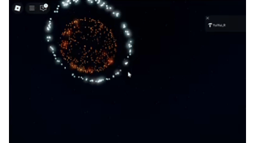

### This is my Roblox Library.

- Boids algorithm for flocking movement
- Fireworks system
- Random maze generation system
- Mob movement system
- Obby component
- Data handling utilities
- Weapon system
- Weather system
- Permission system
- Raycasting
- Sound system
- Other useful functions

### fireworks demo video

  

